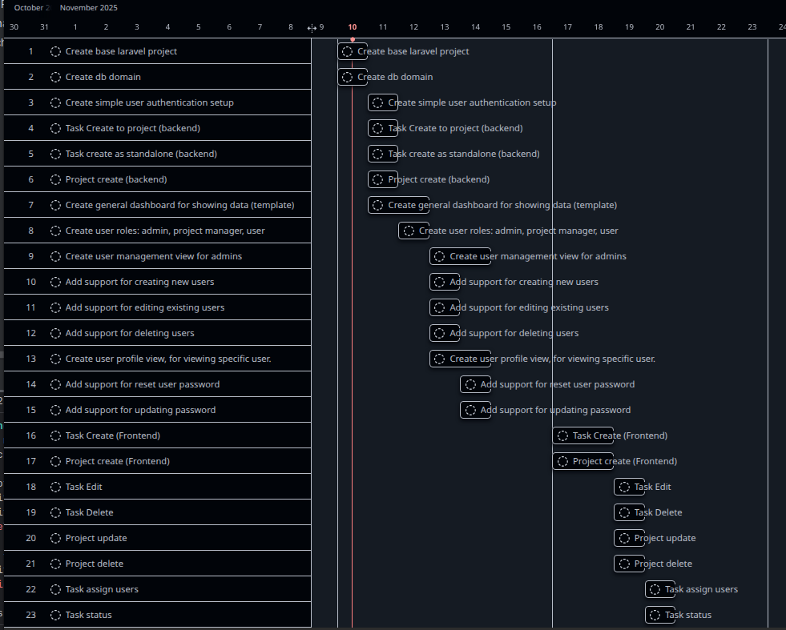
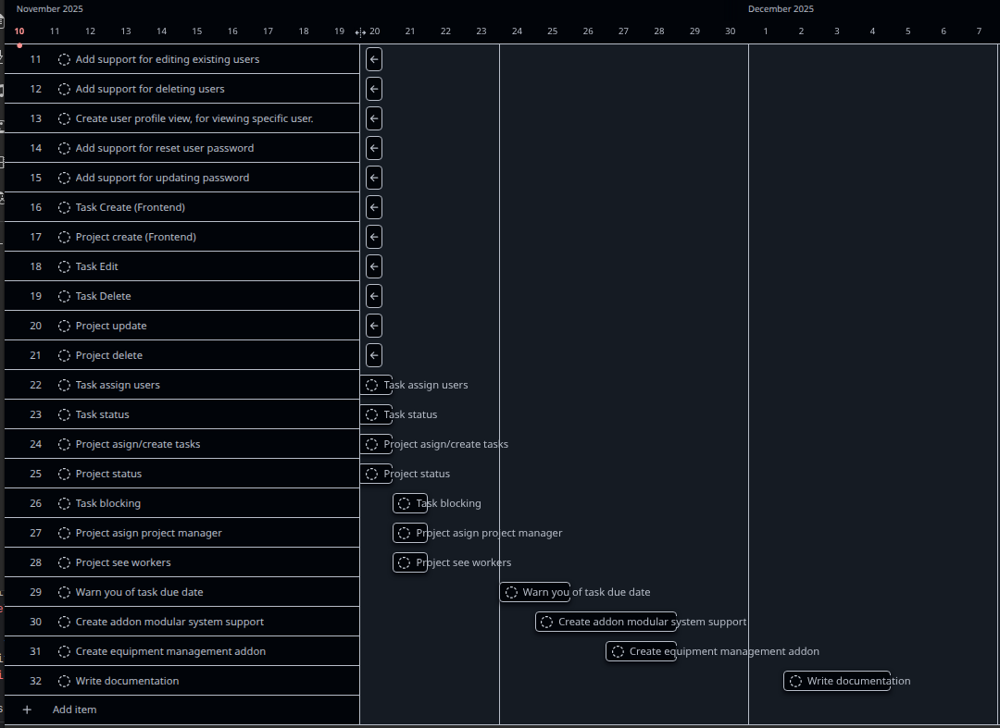
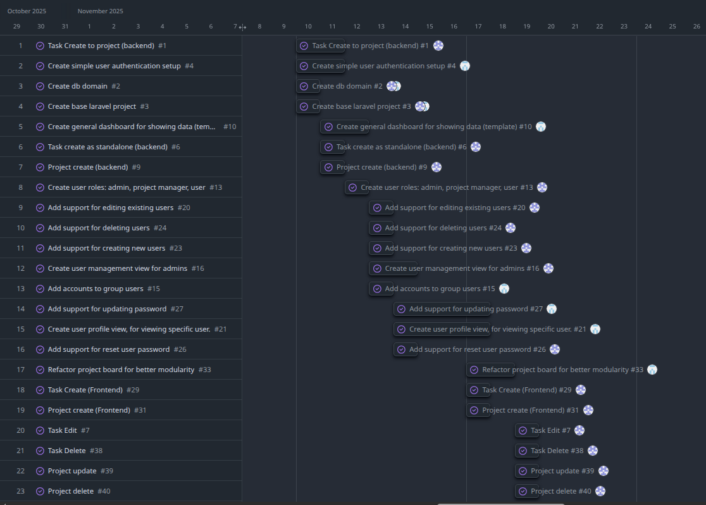
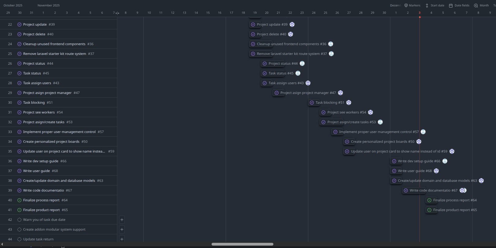

# Process Report

## Estimated timeplan

{ width=50%}

{ width=50%}

---

## Actual timeplan

{ width=50%}

{ width=50%}

---

## Logbooks

### KKL Logbook

#### 10-11-25
- Created tasks
- Planned task time
- Start making task controller

#### 11-11-25
- Finished task controller
- Made project controller

#### 12-11-25
- Made user controller
- Talk with kasper about design choices

#### 13-11-25
- Began to learn react while making user management view
- Made user create, edit and delete

#### 14-11-25
- Had a problem with auth and needed help from Kasper
- Made admin reset password for user

#### 17-11-25
- Made task and project creation
    - Had a problem, the project board wouldn't update

#### 18-11-25
- Had a good night sleep

#### 19-11-25
- Status meating
- Made the edit for project and task
- Start making a genetic delete modal, to confirm things.

#### 20-11-25
- Finished making the confirm modal
- Made user assign to task

#### 21-11-25
- Made project assignable to new project manager

#### 24-11-25
- Made task blocking other tasks

#### 25-11-25
- Project cards shows users, that has worked on a task in the project.

#### 26-11-25
- Cleaned up:
    - Project create/edit
    - Task create/edit
    - User management
    - User create/edit

#### 27-11-25
- Made personalized project boards

#### 1-12-25
- Making documentation together

#### 2-12-25
- Making documentation

#### 3-12-25
- Finsihed documentation

#### 4-12-25
- Prof reading report.
- Finalizing reports.

---

### KRC Logbook

#### 2025-11-10:

- Worked on task planning.
- Worked on making an estimated time plan.
- Created a database diagram model.
- Helped set up a base laravel project.

#### 2025-11-11:

- Created docker setup to prevent needing to install database and web server locally.
- Worked on simple user authentication, laravel starter kit includes this by default.
- Worked on the general dashboard for showing projects and tasks.

#### 2025-11-12:

- Continued work on the project dashboard, splitting it into smaller components.
- Talk with Kasper about design.
- Changed ui styling, based on GitHub soft dark style.
- Began planning how to implement accounts.

#### 2025-11-13:

- Created a basic account system.
- Connected account model and table to user, projects and tasks models and tables.
- Discovered issues with the account scope, which caused infinite loops.
- Found issues with api requests not being correctly stateful.
- Fixed these issues.

#### 2025-11-14:

- Worked on the user profile page by copying the settings page from the laravel starter kit.

#### 2025-11-17:

- Finished the user profile page.
- Started work on refactoring the project page to make it more reusable.

#### 2025-11-18:

- Created layout config to make it easier to change the layout of the project boards.

#### 2025-11-19:

- Fixed error introduced yesterday.
- Refactored password reset page, be able to remove starter kit route management system.
- Removed delete user in profile page.
- Removed vite wayfinder package.
- Removed unused settings pages and routes.

#### 2025-11-20:

- Finalized removing starter kit route system.
- Started work on implementing drag and drop functionality.

#### 2025-11-21:

- Finished basic drag and drop functionality.

#### 2025-11-24:

- Had issues where it couldn't load any tasks.
- Fixed issue with loading, the issue was a naming issue between windows and linux

#### 2025-11-25:

- Started work on implementing new project board for showing only project tasks.
- Replaced dashboard with default project board.

#### 2025-11-26:

- Updated refresh logic to prevent page reload.
- Updated project board to show only tasks assigned to the project.
- Looked into user management to see if we could easily make roles work across all routes. (User management is challenging to implement in a short period of time)

#### 2025-11-27:

- Status meeting.
- discussion about remaining tasks.
- Worked on cleaning up the code.

#### 2025-11-28:

- Looked through the case to see if we had any missing critical features.
- Found no missing features, excluding MLP milestone features.
- Looked into implementing proper role handling, though didn't find a way to do it in a short period of time.

#### 2025-12-01:

- Discussed how to write the documentation.
- Updated tech stack.
- Worked on writing process report conclusion with Kasper.
- Started writing dev setup guide.

#### 2025-12-02:

- Finished writing dev setup guide.
- Started writing code documentation.

#### 2025-12-03:

- Finished writing code documentation.

#### 2025-12-04:

- Prof reading report.
- Finalizing reports.

---

## Conclusion

We've achieved most of our goals, in making the project management app.  
We didn't get around to implementing all the features we wanted to, but we got through the most important ones.  
We had begun working towards implementing custom layout support, which would be a part of the addon system. 

Some of the features we didn't get around to are:
- Creating a modular addon system.
- Implementing backend handling of role.
- Updating auth pages UI. (login, register and initial page)
