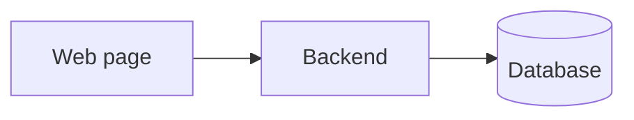
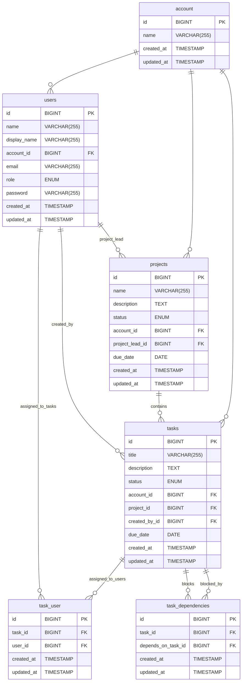

# Project Overview

The project management app is a streamlined web-based project management tool, designed to help businesses manage their
projects more efficiently and give an overview of which projects people are working on.

The web interface is designed to be simple and intuitive to use.

#### It consists of two main components:

- A web-based interface for users to manage their projects and tasks.
- A backend API service that handles all data management and business logic.

#### There are only 3 user roles:

- Admin: Can handle user management.
- Project manager: Can create, edit, and delete projects and tasks.
- User: Can create, edit, and delete tasks.

---

# Functional requirements:

## Admin

- User authentication.
- user management.
    - roles (admins, project managers, users)
    - user management, only available for admins (create, edit, delete)
        - Can reset password
        - Can change roles.
    - user profile, available for all users (edit)
        - Can't change name, but can add display name.
        - Can't change roles.
        - Other info can be changed.

## Systems

- Task management. (create, edit, delete)
    - Can be created as part of a project, or as a standalone task.
    - Can be assigned to any amount of users.
    - Can be created by all users.
    - Can be marked as blocking other tasks.
    - Can have a status. (Open, In progress, Done, Cancelled)
- Project management. (create, edit, delete)
    - Can have multiple tasks in a single project.
    - Can create tasks as part of the project.
    - Can be assigned to a single user, who acts as project lead.
    - Can only be created by project managers.
    - List of users who have worked on the project, to be shown on the project card in the dashboards.
    - Can have a status. (Open, In progress, Done, Cancelled)

## Dashboards

- Management overview. (kanban style board with all tasks across all projects and users)
    - The default dashboard shows all tasks and projects.
- Personalized dashboard. (Specialized for user, derives from user overview)
    - Shows all tasks/projects assigned to/created by the user.
- Project overview. (Specialized for project derives from user overview)
    - Shows all tasks assigned to the project.

---

# Missing Features

Any issues discovered during development.

- account management:
    - Currently account exists only in the database.
    - It should be possible to see the name of the account.
    - It should be possible to update the name of the account.

- User roles:
    - You can assign a role to users.
    - Roles has no real meaning as the handling of different roles isn't fully implemented, so currently it treats all
      users as admins.

- Project overview:
    - Can't see user assigned to task, but can still assign to.

- Welcome and auth pages:
    - Missing UI overhaul.

- User profile:
    - The input fields are not styled properly.

- Updated logo.

---

# Domain model:

The system setup isn't very complex, as it's a simple project management app.

---

# Database model:

---

# Tech stack

## Backend

- [PHP](https://www.php.net/)
- [Laravel framework](https://laravel.com/)

## Website

- [Typescript](https://www.typescriptlang.org/)
- [React](https://reactjs.org/)

## Database

- [MySQL](https://www.mysql.com/)

---

# Dev setup guide

## Requirements

- Docker
- Docker Compose

or

- php 8.3.x NTS (Not Thread Safe)
- Composer
- MySql
- Npm
- Node

My recommendation is to use docker, as it's easier to set up, and doesn't require any additional software to be installed.

## Code base

The code base is located on GitHub.  
Repository: <https://github.com/krc-coding/H6-Svendepr-ve.git>

To use the project, you can either clone the repository or download the zip.  
Cloning is recommended if you want to contribute to the project, or if you want to use the latest version without having to redownload the zip every time. 

To clone the repository use one of the following methods:
1. using git over https: `git clone https://github.com/krc-coding/H6-Svendepr-ve.git`
2. using git over ssh: `git ssh git@github.com:krc-coding/H6-Svendepr-ve.git`

If you don't want to use git, then you can download the zip file from the repository page.

## Before you start

Make a copy of the `.env.example` file and rename it to `.env`.  
Update the database related settings in the `.env` file, and make sure that the database exists.  
If you're using docker, then the database will be created automatically, based on the settings in the `.env` file.

## Setup with docker

*Skip this section if you are not using docker.*

Once you have the code base locally, open a terminal and navigate to the `ProjectManager` folder of the code base.  

When setting up the project the first time, it'll take some extra time as it has to download all the required resources.  
But after that it'll be much faster to start.

To start the project, run the following command: `docker-compose up -d`  
To stop the project, run the following command: `docker-compose down`

All commands in the rest of the guide should be run from within the container.  
To open a terminal within the container: `docker exec -it ProjectManager-server bash`

## Installing dependencies

2. Install composer dependencies: `composer install`
3. Install npm dependencies: `npm ci`

## Setting up the backend

Before you can start using the backend, you first need to generate a key for the application, which is used to encrypt the passwords.  
To generate the key, run the following command: `php artisan key:generate`

## Setting up the database

To set up the database, with all the required tables and relations, run the following command: `php artisan migrate`  
If you want to reset the database, run the following command: `php artisan migrate:fresh`

## Starting the backend

*This is only needed if you are not using docker, as the docker container has a nginx web server which handles exposing the backend.*  

To start the backend, run the following command: `php artisan serve`

## Starting the frontend

Before you can start using the frontend, you first need to build the pre compiled assets.  
To build the assets, run the following command: `npm run build`.

If you want to start the frontend in development mode, run the following command: `npm run dev`.  
This will start the frontend in development mode, and will automatically rebuild the assets when changes are made.

---

# User Guide

## Introduction

There are three user types, each with different responsibilities:

- **User**: Can log in, create edit and delete tasks
- **Project managemant**: Can log in, Create edit and delete projects and tasks
- **Admins**: Can log in, have full access to everything

## User Guide

### Login

Every thing is locked behind login

### Boards

There are **three types of boards** available in the system:

- Dash board
- Project board
- Personalized board

Each **task** card includes:
- Title
- Description
- Status
- Created at
- Due date
- Blocked

Each **project** card includes:
- Title
- Description
- Status
- Created at
- Due date
- Users assigned to one ore more tasks

### Dash board

- Can see every task and project
- Can create edit and delete tasks

### Project board

*To open click on a project, in the edit there is a button "Open project"*

- Can only see task that has been created for this project
- Can create edit and delete tasks, only for this project

### Personalized board

- Can see all task and projects you have created and been asigned to
- Can create edit and delete tasks

## Project management Guide

*Can do everything a user can do.*

### Dash board

- Can create edit and delete projects

### Personalized board

- Can create edit and delete projects

## Admin Guide

*Can do everything a user and project management can do.*

### User management

- Can create edit and delete users
- Can reset user password

## Troubleshooting

### Project board

- You can't see users assign to tasks, but you can still assign users to tasks, it will override what users was assigned before

## Final Notes

- Always log out after using the system on shared or public computers.
- For technical issues, contact our support.

---

# Code documentation (backend)

# Code documentation (Frontend)
