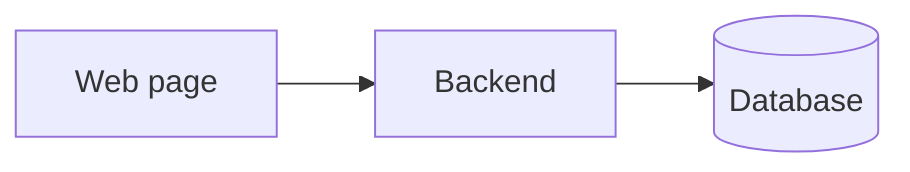
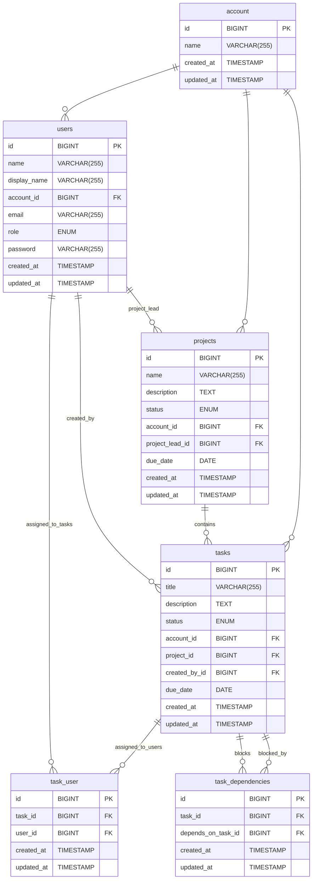

# Project Overview

Short description of the project.

# Functional requirements:

## Admin

- User authentication.
- user management.
    - roles (admins, project managers, users)
    - user management, only available for admins (create, edit, delete)
        - Can reset password
        - Can change roles.
    - user profile, available for all users (edit)
        - Can't change name, but can add display name.
        - Can't change roles.
        - Other info can be changed.

## Systems

- Task management. (create, edit, delete)
    - Can be created as part of a project, or as a standalone task.
    - Can be assigned to any amount of users.
    - Can be created by all users.
    - Can be marked as blocking other tasks.
    - Can have a status. (Open, In progress, Done, Cancelled)
- Project management. (create, edit, delete)
    - Can have multiple tasks in a single project.
    - Can create tasks as part of the project.
    - Can be assigned to a single user, who acts as project lead.
    - Can only be created by project managers.
    - List of users who have worked on the project, to be shown on the project card in the dashboards.
    - Can have a status. (Open, In progress, Done, Cancelled)

## Dashboards

- Management overview. (kanban style board with all tasks across all projects and users)
    - The default dashboard shows all tasks and projects.
- Personalized dashboard. (Specialized for user, derives from user overview)
    - Shows all tasks/projects assigned to/created by the user.
- Project overview. (Specialized for project derives from user overview)
    - Shows all tasks assigned to the project.

---

# Missing Features

Any issues discovered during development.

- account management:
    - Currently account exists only in the database.
    - It should be possible to see the name of the account.
    - It should be possible to update the name of the account.

- User roles:
    - You can assign a role to users.
    - Roles has no real meaning as the handling of different roles isn't fully implemented, so currently it treats all
      users as admins.

- Project overview:
    - Can't see user assigned to task, but can still assign to.

- Welcome and auth pages:
    - Missing UI overhaul.

- User profile:
    - The input fields are not styled properly.

- Updated logo.

---

# Domain model:

The system setup isn't very complex, as it's a simple project management app.

---

# Database model:

---

# Tech stack

## Backend

- [PHP](https://www.php.net/)
- [Laravel framework](https://laravel.com/)

## Website

- [Typescript](https://www.typescriptlang.org/)
- [React](https://reactjs.org/)

## Database

- [MySQL](https://www.mysql.com/)

---

# Dev setup guide

---

# User Guide

---

# Code documentation
