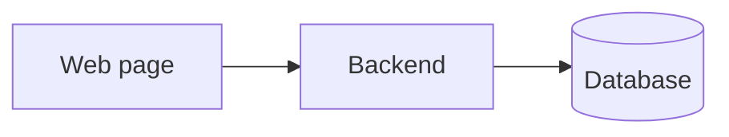
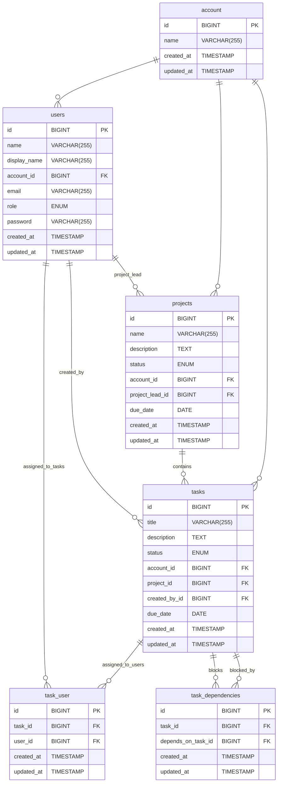

# Project Overview

The project management app is a streamlined web-based project management tool, designed to help businesses manage their
projects more efficiently and give an overview of which projects people are working on.

The web interface is designed to be simple and intuitive to use.

#### It consists of two main components:

- A web-based interface for users to manage their projects and tasks.
- A backend API service that handles all data management and business logic.

#### There are only 3 user roles:

- Admin: Can handle user management.
- Project manager: Can create, edit, and delete projects and tasks.
- User: Can create, edit, and delete tasks.

---

# Functional requirements:

## Admin

- User authentication.
- user management.
    - roles (admins, project managers, users)
    - user management, only available for admins (create, edit, delete)
        - Can reset password
        - Can change roles.
    - user profile, available for all users (edit)
        - Can't change name, but can add display name.
        - Can't change roles.
        - Other info can be changed.

## Systems

- Task management. (create, edit, delete)
    - Can be created as part of a project, or as a standalone task.
    - Can be assigned to any amount of users.
    - Can be created by all users.
    - Can be marked as blocking other tasks.
    - Can have a status. (Open, In progress, Done, Cancelled)
- Project management. (create, edit, delete)
    - Can have multiple tasks in a single project.
    - Can create tasks as part of the project.
    - Can be assigned to a single user, who acts as project lead.
    - Can only be created by project managers.
    - List of users who have worked on the project, to be shown on the project card in the dashboards.
    - Can have a status. (Open, In progress, Done, Cancelled)

## Dashboards

- Management overview. (kanban style board with all tasks across all projects and users)
    - The default dashboard shows all tasks and projects.
- Personalized dashboard. (Specialized for user, derives from user overview)
    - Shows all tasks/projects assigned to/created by the user.
- Project overview. (Specialized for project derives from user overview)
    - Shows all tasks assigned to the project.

---

# Missing Features

Any issues discovered during development.

- account management:
    - Currently account exists only in the database.
    - It should be possible to see the name of the account.
    - It should be possible to update the name of the account.

- User roles:
    - You can assign a role to users.
    - Roles has no real meaning as the handling of different roles isn't fully implemented, so currently it treats all
      users as admins.

- Project overview:
    - Can't see user assigned to task, but can still assign to.

- Welcome and auth pages:
    - Missing UI overhaul.

- User profile:
    - The input fields are not styled properly.

- Updated logo.

---

# Domain model:

The system setup isn't very complex, as it's a simple project management app.



---

# Database model:



---

# Tech stack

## Backend

- [PHP](https://www.php.net/)
- [Laravel framework](https://laravel.com/)

## Website

- [Typescript](https://www.typescriptlang.org/)
- [React](https://reactjs.org/)

## Database

- [MySQL](https://www.mysql.com/)

---

# Dev setup guide

## Requirements

- Git
- Docker
- Docker Compose

or

- Git
- php 8.3.x NTS (Not Thread Safe)
- Composer
- MySql
- Npm
- Node

My recommendation is to use docker, as it's easier to set up, and doesn't require any additional software to be installed.

## Code base

The code base is located on GitHub.  
Repository: <https://github.com/krc-coding/H6-Svendepr-ve.git>

To use the project, you can either clone the repository or download the zip.  
Cloning is recommended if you want to contribute to the project, or if you want to use the latest version without having to redownload the zip every time. 

To clone the repository use one of the following methods:
1. using git over https: `git clone https://github.com/krc-coding/H6-Svendepr-ve.git`
2. using git over ssh: `git clone git@github.com:krc-coding/H6-Svendepr-ve.git`

If you don't want to use git, then you can download the zip file from the repository page.

## Before you start

Make a copy of the `.env.example` file and rename it to `.env`, the file is located in the ProjectManager folder.  
Update the database related settings in the `.env` file, and make sure that the database exists.  
If you're using docker, then the database will be created automatically, based on the settings in the `.env` file.

## Setup with docker

*Skip this section if you are not using docker.*

Once you have the code base locally, open a terminal and navigate to the `ProjectManager` folder of the code base.  

When setting up the project the first time, it'll take some extra time as it has to download all the required resources.  
But after that it'll be much faster to start.

To start the project, run the following command: `docker compose up -d`  
To stop the project, run the following command: `docker compose down`

All commands in the rest of the guide should be run from within the container.  
To open a terminal within the container: `docker exec -it ProjectManager-server bash`

## Installing dependencies

1. Install composer dependencies: `composer install`
2. Install npm dependencies: `npm ci`

If you've installed the dependencies through docker, then you also need to update the user and group of the installed files.  
To do this, run the following command: `chown -R www-user:www-user vendor node_modules`


## Setting up the backend

Before you can start using the backend, you first need to generate a key for the application, which is used to encrypt the passwords.  
To generate the key, run the following command: `php artisan key:generate`

## Setting up the database

To set up the database, with all the required tables and relations, run the following command: `php artisan migrate`  
If you want to reset the database, run the following command: `php artisan migrate:fresh`

## Starting the backend

*This is only needed if you are not using docker, as the docker container has a nginx web server which handles exposing the backend.*  

To start the backend, run the following command: `php artisan serve`

## Starting the frontend

Before you can start using the frontend, you first need to build the pre compiled assets.  
To build the assets, run the following command: `npm run build`.

If you want to start the frontend in development mode, run the following command: `npm run dev`.  
This will start the frontend in development mode, and will automatically rebuild the assets when changes are made.

---

# User Guide

## Introduction

There are three user types, each with different responsibilities:

- **User**: Can log in, create edit and delete tasks
- **Project managemant**: Can log in, Create edit and delete projects and tasks
- **Admins**: Can log in, have full access to everything

## User Guide

### Login

Every thing is locked behind login

### Boards

There are **three types of boards** available in the system:

- Dash board
- Project board
- Personalized board

Each **task** card includes:
- Title
- Description
- Status
- Created at
- Due date
- Blocked

Each **project** card includes:
- Title
- Description
- Status
- Created at
- Due date
- Users assigned to one ore more tasks

### Dash board

- Can see every task and project
- Can create edit and delete tasks

### Project board

*To open click on a project, in the edit there is a button "Open project"*

- Can only see task that has been created for this project
- Can create edit and delete tasks, only for this project

### Personalized board

- Can see all task and projects you have created and been asigned to
- Can create edit and delete tasks

## Project management Guide

*Can do everything a user can do.*

### Dash board

- Can create edit and delete projects

### Personalized board

- Can create edit and delete projects

## Admin Guide

*Can do everything a user and project management can do.*

### User management

- Can create edit and delete users
- Can reset user password

## Troubleshooting

### Project board

- You can't see users assign to tasks, but you can still assign users to tasks, it will override what users was assigned before

## Final Notes

- Always log out after using the system on shared or public computers.
- For technical issues, contact our support.

---

# Code documentation (backend)

## Models

The following models can be found in  
`ProjectManager\app\Models`

### Enum

We use a custom enum as we couldn't get the normal one to work.

```php
public const ROLE_USER = "User";
public const ROLE_ADMIN = 'Admin';
public const ROLE_PROJECT_MANAGER = 'Project manager';
```

Then we have a function to get them all in a array

```php
public static function getRoles(): array
{
    return [
        self::ROLE_USER,
        self::ROLE_ADMIN,
        self::ROLE_PROJECT_MANAGER,
    ];
}
```

### Hidden fields

In our user model we have a *$hidden*, all the field in that array are not parsed over to the resources.  
In this case we don't want the users password to be show, even by accendent.  
We don't use the other three, but it's the same: we don't want to share that.

```php
protected $hidden = [
    'password',
    'two_factor_secret',
    'two_factor_recovery_codes',
    'remember_token',
];
```

### DB relations

This is from Tasks model, this is telling that the task:
- belongs to 0 or unlimited other task
- It's a task model on the other side of this relation
- That it's not the default `tasks_tasks` table we reference to but: `task_dependencies`
- That the column our id need to match is `depends_on_task_id`, not the default: `tasks_id`
- That the `task_id` is our target task that is blocking this task

```php
public function blocking(): BelongsToMany
{
    return $this->belongsToMany(
        Tasks::class,
        'task_dependencies',
        'depends_on_task_id',
        'task_id'
    );
}
```

*All models has this*

This tells us that:
- It has a id in it's own table, is a many to 1
- It uses the defualt column name: `account_id`

```php
public function account(): BelongsTo
{
    return $this->belongsTo(Account::class);
}
```

## Resources

The following resources can be found in  
`ProjectManager\app\Http\Resources`

This is used to filter out data, or modify that data just before sending it out as json.

### Normally

This is the default, if you just want all the data from the model

*This is from the user resource*

```php
public function toArray(Request $request): array
{
    return parent::toArray($request);
}
```

### Modifying the data

Here i assign the id, title and so on the normal way.

`assigned_users` is not a normal value in the table, `assignedTo` is a function in the task model, it is a one to many.  
The array to null if no users is assigned to this task, if so i make it a empty array.  
the function `getTaskDependies` does the same, but also filter out some of the data, e.g. if the task has the status *complete*.

*This is from the task resource*

```php
public function toArray(Request $request): array
{
    return [
        'id' => $this->id,
        'title' => $this->title,
        'description' => $this->description,
        'status' => $this->status,
        'project_id' => $this->project_id,
        'created_by' => $this->created_by,
        'assigned_users' => $this->assignedTo?->pluck('id') ?? [],
        'depends_on' => $this->getTaskDependies(),
        'due_date' => $this->due_date,
        'created_at' => $this->created_at,
    ];
}
```

## Controller

The following controllers can be found in  
`ProjectManager\app\Http\Controllers`

### Get data with dependence

This function does:
- loads all users and task in the assignedTo and dependsOn functions.
- Get the data to use
- Converts them into task resource
- Return that as a list in json

*From task controller*

```php
public function getAllTasks()
{
    return Tasks::with(['assignedTo', 'dependsOn'])
        ->get()
        ->mapInto(TaskResource::class);
}
```

### Update

Request is the body of the http request.  
Task is the task from the db, then you call this endpoint on `api/task/edit/{task}`, the task is the task id.  
The first validation is the task id, if that doesn't exsit in the db, you get an error.  
Now we can validate the body, this time we only validate the new status, we check if
- If the status is in the rquest body
- If it's in, it need to be one of the statuses in our custom enum

Then we set it and save the update.

```php
public function updateStatus(Request $request, Tasks $task)
{
    $request->validate([
        'status' => 'required|in:' . implode(',', Tasks::getStatuses()),
    ]);

    $task->status = $request->status;
    $task->save();

    return new TaskResource($task);
}
```

# Code documentation (Frontend)

## Generalized react features

### Use state

The following examples can be found in  
`ProjectManager\resources\js\pages\dashboard.tsx`

#### Make state

The users is the list you read from and setUsers is the function you call to update the users list.  
This is a IUser array, the default value is a empty list.  
Error as you can see, a string but is also able to be null.

```ts
const [users, setUsers] = useState<IUser[]>([]);
const [error, setError] = useState<string | null>(null);
```

#### Set new state

The `setIsTaskCreateModalOpen` is a boolean and is easy to change the same with `setSelectedTask`.  
`setTasks` is difference as it's an array, i need to make a new array to get react to detect that i have updated the list.

```ts
    const closeCreateTask = () => {
        setIsTaskCreateModalOpen(false);
        setSelectedTask(null);
    }

    const onCreatedNewTask = (newTask: ITask) => {
        setTasks((prevTasks) => [...prevTasks, newTask]);
    }
```

### Component Props

The following examples can be found in  
`ProjectManager\resources\js\pages\dashboard.tsx`  
`ProjectManager\resources\js\pages\project-board.tsx`  
`ProjectManager\resources\js\pages\personalized-boards.tsx`

This interface is private, it's use to tell that the Dashboard wants, as shown in the second block.  
The question mark is used to tell that this item is not need, but if it is in, it needs to be what comes after semicolon.  
E.g. title is not pressent in `PersonalizedBoard`, but is in `ProjectBoardPage`.

```ts
interface DashboardProps {
    title?: string;
    projectLayout?: ProjectLayout;
    overrideTasks?: ITask[];
    overrideProjects?: IProject[];
    projectViewing?: IProject;
}

export default function Dashboard(props: DashboardProps)
```

```ts
export default function PersonalizedBoard() {
    return <Dashboard projectLayout={personalizedLayout} />
}

export default function ProjectBoardPage() {
    const {auth, project} = usePage<ExtendedSharedData>().props;

    return <Dashboard
        projectLayout={projectLayout}
        projectViewing={project}
        overrideTasks={project.tasks}
        title={`Project Board: ${project.name}`}
    />
}
```

## API calls

The backend hosts an AJAX API, which is used to get all the tasks and projects.  
To make it easier to use in the code base, we created an api manager object, which handles making the requests.

The way it's structured is like this:

```ts
export const apiManager = {
    "user": {
        "create": (user: IUser) => {
            return axios.post('/api/user/create', user);
        },
        "get": (userId: number) => {
            return axios.get('/api/user/' + userId);
        },
        "getAll": () => {
            return axios.get('/api/user');
        },
        "getAllProjectManagers": () => {
            return axios.get('/api/user/project_managers');
        },
        "update": (userId: number, user: IUser) => {
            return axios.patch('/api/user/edit/' + userId, user);
        },
        "updatePassword": (userId: number, current_password: string, password: string, passwordConfirmed: string) => {
            return axios.patch('/api/user/update_password/' + userId, {
                "current_password": current_password,
                "password": password,
                "password_confirmation": passwordConfirmed
            })
        },
        "delete": (userId: number) => {
            return axios.delete('/api/user/' + userId);
        }
    },
    "task": {
        "create": (task: ITask) => {
            return axios.post('/api/task/create', task);
        },
        "get": (taskId: number) => {
            return axios.get('/api/task/' + taskId);
        },
        "getAll": () => {
            return axios.get('/api/task');
        },
        "update": (taskId: number, task: ITask) => {
            return axios.patch('/api/task/edit/' + taskId, task);
        },
        "updateStatus": (taskId: number, status: string) => {
            return axios.patch('/api/task/update_status/' + taskId, {"status": status});
        },
        "delete": (taskId: number) => {
            return axios.delete('/api/task/' + taskId);
        }
    },
    "project": {
        "create": (project: IProject) => {
            return axios.post('/api/project/create', project);
        },
        "get": (projectId: number) => {
            return axios.get('/api/project/' + projectId);
        },
        "getAll": () => {
            return axios.get('/api/project');
        },
        "update": (projectId: number, project: IProject) => {
            return axios.put('/api/project/edit/' + projectId, project);
        },
        "updateStatus": (projectId: number, status: string) => {
            return axios.patch('/api/project/update_status/' + projectId, {"status": status});
        },
        "delete": (projectId: number) => {
            return axios.delete('/api/project/' + projectId);
        }
    }
}
```

This approach makes it easy to use, as you only need to import the api-manager object, and then call the method you want
to use, say you want to get a specific project, you would do this: `apiManager.project.get(projectId)`.

## Top level pages

The top level pages are the first files loaded when a user navigates to a specific page.  
They are located in `RoomBookingApp/src/pages/`.

Each of these pages is loaded using laravel Inertia, which allows parsing backend data into React components, like the current authenticated user.

Inertia also provides many useful components for building forms.
But the most useful feature of Inertia is the connection between a laravel backend and a React frontend

## Task loading

When a user opens any of the project boards then, we need to load all related tasks and projects.
We've created this function for loading tasks and a similar one for loading projects.
```ts
const fetchTasks = async () => {
    if (!layout.showTasks) return;

    var tasks;
    if (overrideTasks != null) {
        tasks = overrideTasks;
    }
    else {
        const tasksResponse = await apiManager.task.getAll();
        tasks = tasksResponse.data;
    }

    // Filter out any tasks with invalid statuses
    const validTasks = tasks.filter((task: ITask) => {
        let shouldShow = false;

        if (layout.showOnlyCreatedByMe && task.created_by == auth.user.id) {
            shouldShow = true;
        } else if (!layout.showOnlyCreatedByMe) {
            shouldShow = true;
        } else if (layout.showOnlyAssignedToMe && task.assigned_users.includes(auth.user.id)) {
            shouldShow = true;
        } else if (!layout.showOnlyAssignedToMe) {
            shouldShow = true;
        }

        if (!shouldShow) return false;
        shouldShow = Object.values(TASK_STATUS).includes(task.status as any);
        return shouldShow;
    });

    setTasks(validTasks);
};
```

The way it works is by first checking if the board is configured to show tasks, and if it isn't, then we do an early return.  
After that, we check if the props passed to the component contain any tasks, if it does then we use that, otherwise we make a request to the backend to get all tasks.
After that, we filter out any tasks that don't have a valid status, based on the current layout settings.

Once we have all the tasks, we then filter the tasks based on the current layout settings, and task status.

## Project board structure

Project boards are split into multiple jsx components, as it makes it easier to separate the concerns of each feature.

The dashboard component is the main component for all project boards, it handles loading all the necessary data (tasks, projects and users) and loads the necessary children.

The primary components that makes up project boards are:
```xml
<Dashboard>
    <BaseProject>
        <Column>
            <ProjectItem />
            <TaskItem />
        </Column>
    </BaseProject>
</Dashboard>
```
*Each of these components are located in `ProjectManager/resources/js/components/project/` except the dashboard component, which is located in `ProjectManager/resources/js/pages/`*

The personalized board and specific project board, both wrap the dashboard component.

## Custom layout feature

We've designed a setup in which it's possible to customize the layout of the project boards.  
Currently, we only have three predefined layouts, but it was intended that the addon system would be allowed to add more layouts.

All layouts needs to follow a specific structure, which is described in the `Layout` interface.
```ts
export interface ProjectLayout {
    columns: string[];
    showTasks: boolean;
    showProjects: boolean;
    showOnlyAssignedToMe: boolean;
    showOnlyCreatedByMe: boolean;
    filter: string[];
}
```
